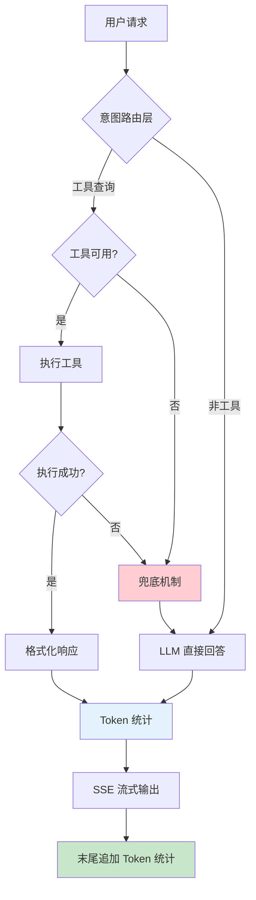
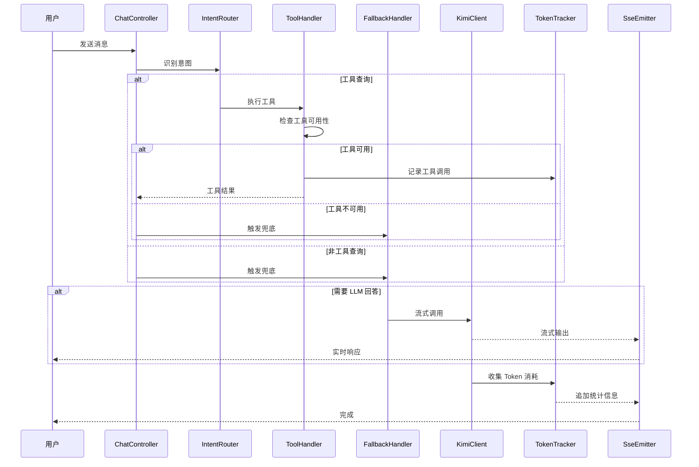

# AI Agent 二次优化 - 设计文档

## Overview

本设计文档定义 MrsHudson AI Agent 二次优化的技术架构和实现方案。本轮优化在第一轮成本优化基础上，着重解决：
1. 兜底回答机制：扩展 AI 能力边界
2. Token 统计：透明化资源消耗
3. 质量优化：平衡质量与性能

## Steering Document Alignment

### Technical Standards (tech.md)

- **Java 17 + Spring Boot 3.2**: 使用 Spring WebFlux 实现 SSE 流式响应
- **SSE (Server-Sent Events)**: 实现流式输出和 token 统计
- **Redis**: 增强缓存策略
- **装饰器模式**: 无侵入式扩展现有服务 (structure.md)


### Project Structure新增代码遵循现有包结构：
```
com.mrshudson/
├── optim/              # 现有：优化模块
│   ├── fallback/       # 新增：兜底回答
│   ├── token/          # 新增：Token 统计
│   ├── context/        # 新增：上下文管理
│   └── quality/       # 新增：质量优化
├── mcp/                # 现有：MCP 工具
├── service/            # 现有：服务层
```

## Architecture

### 核心架构图



### 请求处理流程



## Components and Interfaces

### Component 1: FallbackHandler（兜底回答处理器）

**Purpose:** 当工具不可用或用户问题超出工具范围时，使用 LLM 直接回答。

**核心逻辑：**

```java
public interface FallbackHandler {
    /**
     * 判断是否需要兜底
     * @param message 用户消息
     * @param intentType 识别的意图类型
     * @param toolResult 工具执行结果（可能为 null 或失败）
     * @return boolean 是否需要兜底
     */
    boolean shouldFallback(String message, IntentType intentType, ToolResult toolResult);

    /**
     * 执行兜底回答
     * @param message 用户消息
     * @param context 上下文信息
     * @return Flux<String> 流式响应
     */
    Flux<String> executeFallback(String message, FallbackContext context);
}
```

**兜底判断策略：**

```java
public class FallbackDecisionStrategy {

    public boolean needFallback(String message, IntentType intent, ToolResult toolResult) {
        // 1. 非工具类意图，直接兜底
        if (intent == IntentType.GENERAL_CHAT || intent == IntentType.UNKNOWN) {
            return true;
        }

        // 2. 工具类但执行失败
        if (toolResult != null && !toolResult.isSuccess()) {
            return true;
        }

        // 3. 工具不可用或参数提取失败
        if (intent.isToolIntent() && toolResult == null) {
            return true;
        }

        // 4. 用户明确要求 AI 回答（如"你怎么看"、"解释一下"）
        if (isGeneralKnowledgeQuestion(message)) {
            return true;
        }

        return false;
    }

    private boolean isGeneralKnowledgeQuestion(String message) {
        // 通用知识问答关键词
        String[] patterns = {"什么是", "为什么", "怎么", "如何", "解释", "你怎么看"};
        for (String pattern : patterns) {
            if (message.contains(pattern)) {
                return true;
            }
        }
        return false;
    }
}
```

**兜底提示词构建：**

```java
public class FallbackPromptBuilder {

    public String buildPrompt(String userMessage, List<ToolDescription> availableTools) {
        StringBuilder prompt = new StringBuilder();

        prompt.append("你是一个智能助手。请根据你的知识回答用户的问题。\n\n");

        // 添加工具描述作为参考（但不强制使用）
        if (availableTools != null && !availableTools.isEmpty()) {
            prompt.append("【可用的工具参考】（如果有帮助可以使用，否则直接回答）：\n");
            for (ToolDescription tool : availableTools) {
                prompt.append("- ").append(tool.getName()).append(": ")
                      .append(tool.getDescription()).append("\n");
            }
            prompt.append("\n");
        }

        prompt.append("【重要提示】\n");
        prompt.append("1. 优先使用你的知识回答，如果工具能提供更准确的信息可以使用工具\n");
        prompt.append("2. 如果不确定信息，请明确告知用户\n");
        prompt.append("3. 回答要友好、简洁、有帮助\n\n");

        prompt.append("用户问题：").append(userMessage);

        return prompt.toString();
    }
}
```

### Component 2: TokenTracker（Token 统计追踪器）

**Purpose:** 追踪和统计每次 AI 调用的 token 消耗，并在响应末尾显示。

**接口定义：**

```java
public interface TokenTracker {

    /**
     * 开始追踪一次请求
     * @return追踪 ID
     */
    String startTracking();

    /**
     * 记录输入 token
     */
    void recordInputTokens(String trackingId, int tokens);

    /**
     * 记录输出 token
     */
    void recordOutputTokens(String trackingId, int tokens);

    /**
     * 获取统计结果
     */
    TokenUsage getUsage(String trackingId);

    /**
     * 生成统计消息
     */
    String formatStatistics(TokenUsage usage);

    /**
     * 获取预估成本
     */
    BigDecimal calculateCost(TokenUsage usage);
}
```

**Token 统计服务：**

```java
@Service
public class TokenTrackerService implements TokenTracker {

    private final Map<String, TokenUsage> trackingStore = new ConcurrentHashMap<>();
    private final Map<String, Long> startTimes = new ConcurrentHashMap<>();

    // Token 价格（单位：元 / 1M tokens）
    private static final BigDecimal INPUT_PRICE = new BigDecimal("12.00");
    private static final BigDecimal OUTPUT_PRICE = new BigDecimal("12.00");

    @Override
    public String startTracking() {
        String trackingId = UUID.randomUUID().toString();
        startTimes.put(trackingId, System.currentTimeMillis());
        trackingStore.put(trackingId, new TokenUsage());
        return trackingId;
    }

    @Override
    public void recordInputTokens(String trackingId, int tokens) {
        TokenUsage usage = trackingStore.get(trackingId);
        if (usage != null) {
            usage.setInputTokens(tokens);
        }
    }

    @Override
    public void recordOutputTokens(String trackingId, int tokens) {
        TokenUsage usage = trackingStore.get(trackingId);
        if (usage != null) {
            usage.setOutputTokens(tokens);
        }
    }

    @Override
    public TokenUsage getUsage(String trackingId) {
        return trackingStore.get(trackingId);
    }

    @Override
    public String formatStatistics(TokenUsage usage) {
        if (usage == null) {
            return "";
        }

        int total = usage.getInputTokens() + usage.getOutputTokens();
        BigDecimal cost = calculateCost(usage);

        return String.format(
            "\n\n--- 💡 本次对话消耗 ---\n" +
            "📥 输入: %d tokens\n" +
            "📤 输出: %d tokens\n" +
            "📊 总计: %d tokens\n" +
            "💰 预估成本: ¥%s\n" +
            "------------------------",
            usage.getInputTokens(),
            usage.getOutputTokens(),
            total,
            cost.setScale(4, RoundingMode.HALF_UP)
        );
    }

    @Override
    public BigDecimal calculateCost(TokenUsage usage) {
        if (usage == null) {
            return BigDecimal.ZERO;
        }

        BigDecimal inputCost = usage.getInputTokens()
            .multiply(INPUT_PRICE)
            .divide(BigDecimal.valueOf(1_000_000), 6, RoundingMode.HALF_UP);

        BigDecimal outputCost = usage.getOutputTokens()
            .multiply(OUTPUT_PRICE)
            .divide(BigDecimal.valueOf(1_000_000), 6, RoundingMode.HALF_UP);

        return inputCost.add(outputCost);
    }
}
```

**SSE 流式响应 + Token 统计：**

```java
@Service
public class StreamChatService {

    @Autowired
    private TokenTrackerService tokenTracker;

    @Autowired
    private KimiClient kimClient;

    public Flux<String> streamChatWithTokenStats(String message, Long userId) {
        // 1. 开始 token 追踪
        String trackingId = tokenTracker.startTracking();

        // 2. 构建请求
        ChatRequest request = buildRequest(message);

        // 3. 流式调用并收集输出 token
        AtomicInteger outputTokens = new AtomicInteger(0);

        Flux<String> streamFlux = kimClient.streamChat(request)
            .doOnNext(chunk -> {
                // 统计输出 token（按字符估算）
                outputTokens.addAndGet(estimateTokens(chunk));
            })
            .doOnComplete(() -> {
                // 流式完成，记录输出 token
                tokenTracker.recordOutputTokens(trackingId, outputTokens.get());
            });

        // 4. 在末尾追加 token 统计
        return streamFlux
            .concatWith(Flux.defer(() -> {
                TokenUsage usage = tokenTracker.getUsage(trackingId);
                String stats = tokenTracker.formatStatistics(usage);
                return Flux.just(stats);
            }));
    }

    private int estimateTokens(String text) {
        // 简单估算：中文字符约等于 1 token，英文约等于 4 字符 1 token
        int chineseChars = text.chars().filter(c -> c > 127).count();
        int asciiChars = text.length() - chineseChars;
        return chineseChars + (asciiChars / 4);
    }
}
```

### Component 3: ContextManager（上下文管理器）

**Purpose:** 智能管理对话上下文，支持压缩和截断策略。

**接口定义：**

```java
public interface ContextManager {

    /**
     * 构建优化的上下文
     * @param conversationId 会话 ID
     * @param userId 用户 ID
     * @return 优化后的消息列表
     */
    List<Message> buildOptimizedContext(Long conversationId, Long userId);

    /**
     * 判断是否需要压缩
     * @param messages 消息列表
     * @return boolean
     */
    boolean needsCompression(List<Message> messages);

    /**
     * 执行上下文压缩
     * @param messages 需要压缩的消息
     * @return 压缩后的消息列表
     */
    List<Message> compress(List<Message> messages);

    /**
     * 估算 token 数量
     */
    int estimateTokens(List<Message> messages);
}
```

**上下文压缩实现：**

```java
@Service
public class ContextManagerImpl implements ContextManager {

    private static final int TRIGGER_THRESHOLD = 15;      // 触发压缩的消息数
    private static final int KEEP_RECENT = 6;              // 保留的最近消息数
    private static final int SUMMARY_MAX_LENGTH = 200;     // 摘要最大字数

    @Autowired
    private KimiClient kimClient;

    @Override
    public List<Message> buildOptimizedContext(Long conversationId, Long userId) {
        List<ChatMessage> history = chatMessageMapper.selectByConversationId(conversationId);

        if (!needsCompression(history)) {
            return convertToMessages(history);
        }

        // 需要压缩
        return compress(convertToMessages(history));
    }

    @Override
    public boolean needsCompression(List<Message> messages) {
        return messages.size() > TRIGGER_THRESHOLD;
    }

    @Override
    public List<Message> compress(List<Message> messages) {
        if (messages.size() <= KEEP_RECENT) {
            return messages;
        }

        // 1. 保留最近的消息
        List<Message> recent = messages.subList(messages.size() - KEEP_RECENT, messages.size());

        // 2. 压缩早期消息
        List<Message> older = messages.subList(0, messages.size() - KEEP_RECENT);

        String summary = generateSummary(older);

        // 3. 构建压缩后的上下文
        List<Message> compressed = new ArrayList<>();
        compressed.add(new Message("system", "【历史摘要】" + summary));
        compressed.addAll(recent);

        return compressed;
    }

    private String generateSummary(List<Message> messages) {
        // 构建摘要提示词
        String prompt = "请用不超过" + SUMMARY_MAX_LENGTH + "字概括以下对话的主题和关键信息：\n\n";

        for (Message msg : messages) {
            prompt += msg.getRole() + ": " + msg.getContent() + "\n";
        }

        // 调用轻量模型生成摘要
        ChatRequest request = ChatRequest.builder()
            .model("moonshot-v1-8k")
            .messages(List.of(
                Message.system("你是一个对话摘要助手。"),
                Message.user(prompt)
            ))
            .maxTokens(100)
            .temperature(0.3)
            .build();

        return kimClient.chatCompletion(request);
    }

    @Override
    public int estimateTokens(List<Message> messages) {
        int total = 0;
        for (Message msg : messages) {
            total += estimateTokens(msg.getContent());
        }
        return total;
    }

    private int estimateTokens(String text) {
        if (text == null) return 0;
        int chineseChars = text.chars().filter(c -> c > 127).count();
        int asciiChars = text.length() - chineseChars;
        return chineseChars + (asciiChars / 4);
    }
}
```

### Component 4: QualityOptimizer（质量优化器）

**Purpose:** 根据配置和上下文自动调整 AI 参数，优化响应质量。

**配置模型：**

```java
@Data
@ConfigurationProperties(prefix = "ai.quality")
public class QualityProperties {

    private Mode mode = Mode.BALANCED;

    private int maxTokens = 800;

    private double temperature = 0.3;

    private boolean enableFullContext = true;

    public enum Mode {
        SPEED,      // 速度优先
        BALANCED,   // 平衡模式
        QUALITY     // 质量优先
    }

    public void applyMode(Mode mode) {
        switch (mode) {
            case SPEED:
                this.maxTokens = 400;
                this.temperature = 0.2;
                this.enableFullContext = false;
                break;
            case BALANCED:
                this.maxTokens = 800;
                this.temperature = 0.3;
                this.enableFullContext = true;
                break;
            case QUALITY:
                this.maxTokens = 2000;
                this.temperature = 0.7;
                this.enableFullContext = true;
                break;
        }
    }
}
```

**质量优化服务：**

```java
@Service
public class QualityOptimizer {

    @Autowired
    private QualityProperties qualityProperties;

    /**
     * 自动检测并优化质量参数
     */
    public ChatRequest optimizeRequest(String message, ChatRequest baseRequest) {
        ChatRequest.Builder builder = baseRequest.toBuilder();

        // 1. 检测问题复杂度
        if (isComplexQuestion(message)) {
            // 复杂问题，提升质量
            builder.maxTokens(Math.min(qualityProperties.getMaxTokens() * 2, 2000));
            builder.temperature(Math.min(qualityProperties.getTemperature() + 0.2, 0.9));
        }

        // 2. 检测是否需要创意回答
        if (needsCreativity(message)) {
            builder.temperature(0.8);
        }

        // 3. 应用配置模式
        qualityProperties.applyMode(qualityProperties.getMode());

        builder.maxTokens(qualityProperties.getMaxTokens());
        builder.temperature(qualityProperties.getTemperature());

        return builder.build();
    }

    private boolean isComplexQuestion(String message) {
        // 复杂问题特征：长文本、多个问题、多轮推理
        return message.length() > 200
            || message.contains("?") && message.split("\\?").length > 2
            || message.contains("首先") && message.contains("然后");
    }

    private boolean needsCreativity(String message) {
        String[] creativityKeywords = {"创意", "想象", "看法", "建议", "写一首", "编一个"};
        for (String keyword : creativityKeywords) {
            if (message.contains(keyword)) {
                return true;
            }
        }
        return false;
    }
}
```

## Data Models

### TokenUsage（Token 消耗统计）

```java
@Data
@Builder
public class TokenUsage {
    private Integer inputTokens;
    private Integer outputTokens;
    private Long duration;          // 响应耗时（毫秒）
    private String model;           // 使用的模型
    private LocalDateTime timestamp;
}
```

### FallbackContext（兜底上下文）

```java
@Data
@Builder
public class FallbackContext {
    private String userMessage;
    private Long userId;
    private Long conversationId;
    private IntentType originalIntent;
    private ToolResult failedToolResult;
    private List<ToolDescription> availableTools;
    private List<Message> conversationHistory;
}
```

### FallbackDecision（兜底决策结果）

```java
@Data
@Builder
public class FallbackDecision {
    private boolean shouldFallback;
    private FallbackReason reason;
    private String suggestedPrompt;

    public enum FallbackReason {
        NON_TOOL_INTENT,          // 非工具类意图
        TOOL_EXECUTION_FAILED,    // 工具执行失败
        TOOL_UNAVAILABLE,         // 工具不可用
        GENERAL_KNOWLEDGE,        // 通用知识问答
        USER_REQUEST              // 用户明确要求 AI 回答
    }
}
```

## Error Handling

### Error Scenarios

1. **兜底调用失败**
   - Handling: 返回友好错误消息"抱歉，我现在无法回答这个问题"
   - User Impact: 用户收到错误提示，但不影响其他功能

2. **Token 统计计算错误**
   - Handling: 跳过统计，不阻断响应返回
   - User Impact: 无感知

3. **上下文压缩超时**
   - Handling: 降级为简单截断策略
   - User Impact: 可能丢失部分历史信息

4. **SSE 连接中断**
   - Handling: 记录已发送的 token 统计
   - User Impact: 可能无法看到完整的 token 统计

## Testing Strategy

### Unit Testing

- **FallbackHandlerTest**: 测试各种场景下的兜底判断逻辑
- **TokenTrackerTest**: 测试 token 统计和格式化
- **ContextManagerTest**: 测试压缩触发条件和摘要生成
- **QualityOptimizerTest**: 测试参数优化逻辑

### Integration Testing

- **FallbackIntegrationTest**: 测试完整兜底流程
- **StreamWithTokenStatsIntegrationTest**: 测试流式响应和 token 统计
- **ContextCompressionIntegrationTest**: 测试上下文压缩效果

### End-to-End Testing

- **FullConversationE2ETest**: 测试完整对话流程
- **TokenConsumptionE2ETest**: 验证 token 统计准确性
