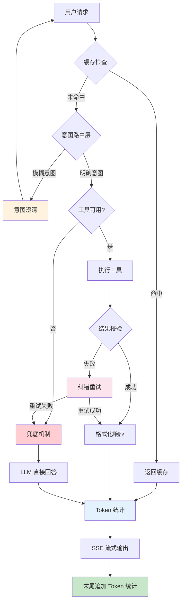
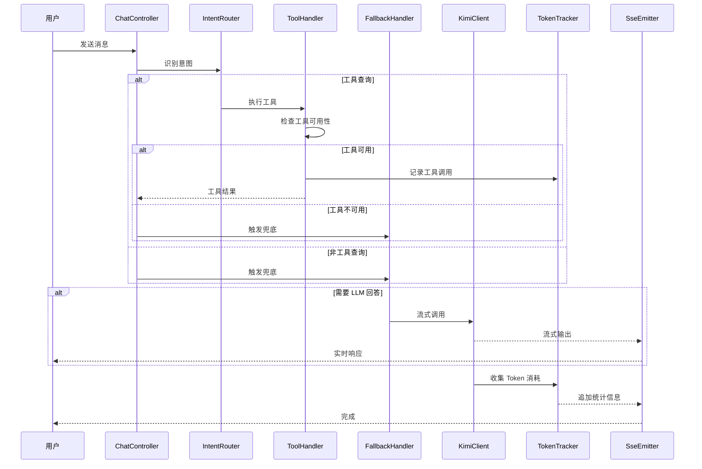

# AI Agent 二次优化 - 设计文档

## Overview

本设计文档定义 MrsHudson AI Agent 二次优化的技术架构和实现方案。本轮优化在第一轮成本优化基础上，着重解决：
1. 兜底回答机制：扩展 AI 能力边界
2. Token 统计：透明化资源消耗
3. 质量优化：平衡质量与性能
4. 意图理解增强：正确理解用户意图（回答问题1）
5. 自纠错机制：AI回复有误时自动纠正（回答问题2）
6. 成本优化：降低AI调用成本

## Steering Document Alignment

### Technical Standards (tech.md)

- **Java 17 + Spring Boot 3.2**: 使用 Spring WebFlux 实现 SSE 流式响应
- **SSE (Server-Sent Events)**: 实现流式输出和 token 统计
- **Redis**: 增强缓存策略
- **装饰器模式**: 无侵入式扩展现有服务 (structure.md)


### Project Structure新增代码遵循现有包结构：
```
com.mrshudson/
├── optim/              # 现有：优化模块
│   ├── fallback/       # 兜底回答
│   ├── token/          # Token 统计
│   ├── context/        # 上下文管理
│   ├── quality/        # 质量优化
│   ├── intent/         # 意图理解增强 ← 新增
│   ├── correction/     # 自纠错机制 ← 新增
│   └── cost/          # 成本优化 ← 新增
├── mcp/                # 现有：MCP 工具
├── service/            # 现有：服务层
```

## Architecture

### 核心架构图（增强版）



### 请求处理流程



## Components and Interfaces

### Component 1: FallbackHandler（兜底回答处理器）

**Purpose:** 当工具不可用或用户问题超出工具范围时，使用 LLM 直接回答。

**核心逻辑：**

```java
public interface FallbackHandler {
    /**
     * 判断是否需要兜底
     * @param message 用户消息
     * @param intentType 识别的意图类型
     * @param toolResult 工具执行结果（可能为 null 或失败）
     * @return boolean 是否需要兜底
     */
    boolean shouldFallback(String message, IntentType intentType, ToolResult toolResult);

    /**
     * 执行兜底回答
     * @param message 用户消息
     * @param context 上下文信息
     * @return Flux<String> 流式响应
     */
    Flux<String> executeFallback(String message, FallbackContext context);
}
```

**兜底判断策略：**

```java
public class FallbackDecisionStrategy {

    public boolean needFallback(String message, IntentType intent, ToolResult toolResult) {
        // 1. 非工具类意图，直接兜底
        if (intent == IntentType.GENERAL_CHAT || intent == IntentType.UNKNOWN) {
            return true;
        }

        // 2. 工具类但执行失败
        if (toolResult != null && !toolResult.isSuccess()) {
            return true;
        }

        // 3. 工具不可用或参数提取失败
        if (intent.isToolIntent() && toolResult == null) {
            return true;
        }

        // 4. 用户明确要求 AI 回答（如"你怎么看"、"解释一下"）
        if (isGeneralKnowledgeQuestion(message)) {
            return true;
        }

        return false;
    }

    private boolean isGeneralKnowledgeQuestion(String message) {
        // 通用知识问答关键词
        String[] patterns = {"什么是", "为什么", "怎么", "如何", "解释", "你怎么看"};
        for (String pattern : patterns) {
            if (message.contains(pattern)) {
                return true;
            }
        }
        return false;
    }
}
```

**兜底提示词构建：**

```java
public class FallbackPromptBuilder {

    public String buildPrompt(String userMessage, List<ToolDescription> availableTools) {
        StringBuilder prompt = new StringBuilder();

        prompt.append("你是一个智能助手。请根据你的知识回答用户的问题。\n\n");

        // 添加工具描述作为参考（但不强制使用）
        if (availableTools != null && !availableTools.isEmpty()) {
            prompt.append("【可用的工具参考】（如果有帮助可以使用，否则直接回答）：\n");
            for (ToolDescription tool : availableTools) {
                prompt.append("- ").append(tool.getName()).append(": ")
                      .append(tool.getDescription()).append("\n");
            }
            prompt.append("\n");
        }

        prompt.append("【重要提示】\n");
        prompt.append("1. 优先使用你的知识回答，如果工具能提供更准确的信息可以使用工具\n");
        prompt.append("2. 如果不确定信息，请明确告知用户\n");
        prompt.append("3. 回答要友好、简洁、有帮助\n\n");

        prompt.append("用户问题：").append(userMessage);

        return prompt.toString();
    }
}
```

### Component 2: TokenTracker（Token 统计追踪器）

**Purpose:** 追踪和统计每次 AI 调用的 token 消耗，并在响应末尾显示。

**接口定义：**

```java
public interface TokenTracker {

    /**
     * 开始追踪一次请求
     * @return追踪 ID
     */
    String startTracking();

    /**
     * 记录输入 token
     */
    void recordInputTokens(String trackingId, int tokens);

    /**
     * 记录输出 token
     */
    void recordOutputTokens(String trackingId, int tokens);

    /**
     * 获取统计结果
     */
    TokenUsage getUsage(String trackingId);

    /**
     * 生成统计消息
     */
    String formatStatistics(TokenUsage usage);

    /**
     * 获取预估成本
     */
    BigDecimal calculateCost(TokenUsage usage);
}
```

**Token 统计服务：**

```java
@Service
public class TokenTrackerService implements TokenTracker {

    private final Map<String, TokenUsage> trackingStore = new ConcurrentHashMap<>();
    private final Map<String, Long> startTimes = new ConcurrentHashMap<>();

    // Token 价格从配置读取（单位：元 / 1M tokens），默认值 Kimi API
    @Value("${ai.pricing.input:12.00}")
    private BigDecimal inputPrice;

    @Value("${ai.pricing.output:12.00}")
    private BigDecimal outputPrice;

    @Override
    public String startTracking() {
        String trackingId = UUID.randomUUID().toString();
        startTimes.put(trackingId, System.currentTimeMillis());
        trackingStore.put(trackingId, new TokenUsage());
        return trackingId;
    }

    @Override
    public void recordInputTokens(String trackingId, int tokens) {
        TokenUsage usage = trackingStore.get(trackingId);
        if (usage != null) {
            usage.setInputTokens(tokens);
        }
    }

    @Override
    public void recordOutputTokens(String trackingId, int tokens) {
        TokenUsage usage = trackingStore.get(trackingId);
        if (usage != null) {
            usage.setOutputTokens(tokens);
        }
    }

    @Override
    public TokenUsage getUsage(String trackingId) {
        return trackingStore.get(trackingId);
    }

    @Override
    public String formatStatistics(TokenUsage usage) {
        if (usage == null) {
            return "";
        }

        int total = usage.getInputTokens() + usage.getOutputTokens();
        BigDecimal cost = calculateCost(usage);

        return String.format(
            "\n\n--- 💡 本次对话消耗 ---\n" +
            "📥 输入: %d tokens\n" +
            "📤 输出: %d tokens\n" +
            "📊 总计: %d tokens\n" +
            "💰 预估成本: ¥%s\n" +
            "------------------------",
            usage.getInputTokens(),
            usage.getOutputTokens(),
            total,
            cost.setScale(4, RoundingMode.HALF_UP)
        );
    }

    @Override
    public BigDecimal calculateCost(TokenUsage usage) {
        if (usage == null) {
            return BigDecimal.ZERO;
        }

        BigDecimal inputCost = usage.getInputTokens()
            .multiply(inputPrice)
            .divide(BigDecimal.valueOf(1_000_000), 6, RoundingMode.HALF_UP);

        BigDecimal outputCost = usage.getOutputTokens()
            .multiply(outputPrice)
            .divide(BigDecimal.valueOf(1_000_000), 6, RoundingMode.HALF_UP);

        return inputCost.add(outputCost);
    }
}
```

**SSE 流式响应 + Token 统计：**

```java
@Service
public class StreamChatService {

    @Autowired
    private TokenTrackerService tokenTracker;

    @Autowired
    private KimiClient kimClient;

    public Flux<String> streamChatWithTokenStats(String message, Long userId) {
        // 1. 开始 token 追踪
        String trackingId = tokenTracker.startTracking();

        // 2. 构建请求
        ChatRequest request = buildRequest(message);

        // 3. 流式调用并收集输出 token
        AtomicInteger outputTokens = new AtomicInteger(0);

        Flux<String> streamFlux = kimClient.streamChat(request)
            .doOnNext(chunk -> {
                // 统计输出 token（按字符估算）
                outputTokens.addAndGet(estimateTokens(chunk));
            })
            .doOnComplete(() -> {
                // 流式完成，记录输出 token
                tokenTracker.recordOutputTokens(trackingId, outputTokens.get());
            });

        // 4. 在末尾追加 token 统计
        return streamFlux
            .concatWith(Flux.defer(() -> {
                TokenUsage usage = tokenTracker.getUsage(trackingId);
                String stats = tokenTracker.formatStatistics(usage);
                return Flux.just(stats);
            }));
    }

    private int estimateTokens(String text) {
        // 简单估算：中文字符约等于 1 token，英文约等于 4 字符 1 token
        int chineseChars = text.chars().filter(c -> c > 127).count();
        int asciiChars = text.length() - chineseChars;
        return chineseChars + (asciiChars / 4);
    }
}
```

### Component 3: ContextManager（上下文管理器）

**Purpose:** 智能管理对话上下文，支持压缩和截断策略。

**接口定义：**

```java
public interface ContextManager {

    /**
     * 构建优化的上下文
     * @param conversationId 会话 ID
     * @param userId 用户 ID
     * @return 优化后的消息列表
     */
    List<Message> buildOptimizedContext(Long conversationId, Long userId);

    /**
     * 判断是否需要压缩
     * @param messages 消息列表
     * @return boolean
     */
    boolean needsCompression(List<Message> messages);

    /**
     * 执行上下文压缩
     * @param messages 需要压缩的消息
     * @return 压缩后的消息列表
     */
    List<Message> compress(List<Message> messages);

    /**
     * 估算 token 数量
     */
    int estimateTokens(List<Message> messages);
}
```

**上下文压缩实现：**

```java
@Service
public class ContextManagerImpl implements ContextManager {

    private static final int TRIGGER_THRESHOLD = 15;      // 触发压缩的消息数
    private static final int KEEP_RECENT = 6;              // 保留的最近消息数
    private static final int SUMMARY_MAX_LENGTH = 200;     // 摘要最大字数

    @Autowired
    private KimiClient kimClient;

    @Override
    public List<Message> buildOptimizedContext(Long conversationId, Long userId) {
        List<ChatMessage> history = chatMessageMapper.selectByConversationId(conversationId);

        if (!needsCompression(history)) {
            return convertToMessages(history);
        }

        // 需要压缩
        return compress(convertToMessages(history));
    }

    @Override
    public boolean needsCompression(List<Message> messages) {
        return messages.size() > TRIGGER_THRESHOLD;
    }

    @Override
    public List<Message> compress(List<Message> messages) {
        if (messages.size() <= KEEP_RECENT) {
            return messages;
        }

        // 1. 保留最近的消息
        List<Message> recent = messages.subList(messages.size() - KEEP_RECENT, messages.size());

        // 2. 压缩早期消息
        List<Message> older = messages.subList(0, messages.size() - KEEP_RECENT);

        String summary = generateSummary(older);

        // 3. 构建压缩后的上下文
        List<Message> compressed = new ArrayList<>();
        compressed.add(new Message("system", "【历史摘要】" + summary));
        compressed.addAll(recent);

        return compressed;
    }

    private String generateSummary(List<Message> messages) {
        // 构建摘要提示词
        String prompt = "请用不超过" + SUMMARY_MAX_LENGTH + "字概括以下对话的主题和关键信息：\n\n";

        for (Message msg : messages) {
            prompt += msg.getRole() + ": " + msg.getContent() + "\n";
        }

        // 调用轻量模型生成摘要（模型名从配置读取，默认 moonshot-v1-8k）
        String summaryModel = summaryProperties.getModel();
        ChatRequest request = ChatRequest.builder()
            .model(summaryModel != null ? summaryModel : "moonshot-v1-8k")
            .messages(List.of(
                Message.system("你是一个对话摘要助手。"),
                Message.user(prompt)
            ))
            .maxTokens(100)
            .temperature(0.3)
            .build();

        return kimClient.chatCompletion(request);
    }

    @Override
    public int estimateTokens(List<Message> messages) {
        int total = 0;
        for (Message msg : messages) {
            total += estimateTokens(msg.getContent());
        }
        return total;
    }

    private int estimateTokens(String text) {
        if (text == null) return 0;
        int chineseChars = text.chars().filter(c -> c > 127).count();
        int asciiChars = text.length() - chineseChars;
        return chineseChars + (asciiChars / 4);
    }
}
```

### Component 4: QualityOptimizer（质量优化器）

**Purpose:** 根据配置和上下文自动调整 AI 参数，优化响应质量。

**配置模型：**

```java
@Data
@ConfigurationProperties(prefix = "ai.quality")
public class QualityProperties {

    private Mode mode = Mode.BALANCED;

    private int maxTokens = 800;

    private double temperature = 0.3;

    private boolean enableFullContext = true;

    public enum Mode {
        SPEED,      // 速度优先
        BALANCED,   // 平衡模式
        QUALITY     // 质量优先
    }

    public void applyMode(Mode mode) {
        switch (mode) {
            case SPEED:
                this.maxTokens = 400;
                this.temperature = 0.2;
                this.enableFullContext = false;
                break;
            case BALANCED:
                this.maxTokens = 800;
                this.temperature = 0.3;
                this.enableFullContext = true;
                break;
            case QUALITY:
                this.maxTokens = 2000;
                this.temperature = 0.7;
                this.enableFullContext = true;
                break;
        }
    }
}
```

**质量优化服务：**

```java
@Service
public class QualityOptimizer {

    @Autowired
    private QualityProperties qualityProperties;

    /**
     * 自动检测并优化质量参数
     */
    public ChatRequest optimizeRequest(String message, ChatRequest baseRequest) {
        ChatRequest.Builder builder = baseRequest.toBuilder();

        // 1. 检测问题复杂度
        if (isComplexQuestion(message)) {
            // 复杂问题，提升质量
            builder.maxTokens(Math.min(qualityProperties.getMaxTokens() * 2, 2000));
            builder.temperature(Math.min(qualityProperties.getTemperature() + 0.2, 0.9));
        }

        // 2. 检测是否需要创意回答
        if (needsCreativity(message)) {
            builder.temperature(0.8);
        }

        // 3. 应用配置模式
        qualityProperties.applyMode(qualityProperties.getMode());

        builder.maxTokens(qualityProperties.getMaxTokens());
        builder.temperature(qualityProperties.getTemperature());

        return builder.build();
    }

    private boolean isComplexQuestion(String message) {
        // 复杂问题特征：长文本、多个问题、多轮推理
        return message.length() > 200
            || message.contains("?") && message.split("\\?").length > 2
            || message.contains("首先") && message.contains("然后");
    }

    private boolean needsCreativity(String message) {
        String[] creativityKeywords = {"创意", "想象", "看法", "建议", "写一首", "编一个"};
        for (String keyword : creativityKeywords) {
            if (message.contains(keyword)) {
                return true;
            }
        }
        return false;
    }
}
```

## Data Models

### TokenUsage（Token 消耗统计）

```java
@Data
@Builder
public class TokenUsage {
    private Integer inputTokens;
    private Integer outputTokens;
    private Long duration;          // 响应耗时（毫秒）
    private String model;           // 使用的模型
    private LocalDateTime timestamp;
}
```

### FallbackContext（兜底上下文）

```java
@Data
@Builder
public class FallbackContext {
    private String userMessage;
    private Long userId;
    private Long conversationId;
    private IntentType originalIntent;
    private ToolResult failedToolResult;
    private List<ToolDescription> availableTools;
    private List<Message> conversationHistory;
}
```

### FallbackDecision（兜底决策结果）

```java
@Data
@Builder
public class FallbackDecision {
    private boolean shouldFallback;
    private FallbackReason reason;
    private String suggestedPrompt;

    public enum FallbackReason {
        NON_TOOL_INTENT,          // 非工具类意图
        TOOL_EXECUTION_FAILED,    // 工具执行失败
        TOOL_UNAVAILABLE,         // 工具不可用
        GENERAL_KNOWLEDGE,        // 通用知识问答
        USER_REQUEST              // 用户明确要求 AI 回答
    }
}
```

## 新增组件：意图理解增强（解决用户问题1）

### Component 5: IntentRouter（意图路由器 - 增强版）

**Purpose:** 增强意图识别，支持置信度评估和模糊意图澄清。

```java
public interface IntentRouter {

    /**
     * 识别用户意图
     * @param message 用户消息
     * @return IntentResult 包含意图类型和置信度
     */
    IntentResult recognizeIntent(String message);

    /**
     * 判断是否需要澄清
     * @param intentResult 意图识别结果
     * @return boolean 是否需要用户确认
     */
    boolean needsClarification(IntentResult intentResult);

    /**
     * 构建澄清问题
     * @param message 原始消息
     * @param intentResult 识别结果
     * @return String 澄清问题
     */
    String buildClarification(String message, IntentResult intentResult);
}
```

**意图识别结果**：

```java
@Data
@Builder
public class IntentResult {
    private IntentType type;           // 意图类型
    private double confidence;          // 置信度 0.0-1.0
    private Map<String, Object> extractedParams;  // 提取的参数
    private List<IntentType> candidates;  // 候选意图（置信度相近时）

    public boolean isHighConfidence() {
        return confidence >= 0.8;
    }

    public boolean isAmbiguous() {
        return candidates != null && !candidates.isEmpty();
    }
}
```

**意图类型枚举**：

```java
public enum IntentType {
    // 工具类意图
    WEATHER("天气查询", true),
    CALENDAR("日历事件", true),
    TODO("待办事项", true),
    ROUTE("路线规划", true),

    // 非工具类意图
    GENERAL_CHAT("通用对话", false),
    GENERAL_KNOWLEDGE("知识问答", false),
    QUESTION_ABOUT_AI("关于AI", false),

    // 未知
    UNKNOWN("未知", false);

    private final String description;
    private final boolean isToolIntent;

    public boolean isToolIntent() {
        return isToolIntent;
    }
}
```

**置信度评估策略**：

```java
@Service
public class IntentConfidenceEvaluator {

    private static final double HIGH_CONFIDENCE_THRESHOLD = 0.8;
    private static final double LOW_CONFIDENCE_THRESHOLD = 0.5;

    public double calculateConfidence(String message, IntentType intent) {
        // 1. 关键词匹配得分
        double keywordScore = calculateKeywordScore(message, intent);

        // 2. 上下文相关性得分
        double contextScore = calculateContextScore(message, intent);

        // 3. 综合得分
        return keywordScore * 0.7 + contextScore * 0.3;
    }

    private double calculateKeywordScore(String message, IntentType intent) {
        // 检查消息中是否包含该意图的关键词
        Set<String> keywords = getKeywordsForIntent(intent);
        long matchCount = keywords.stream()
            .filter(message::contains)
            .count();
        return Math.min(1.0, matchCount * 0.3);
    }

    private double calculateContextScore(String message, IntentType intent) {
        // 简单实现：检查与历史消息的相关性
        return 0.8; // 默认值
    }
}
```

**澄清机制实现**：

```java
@Service
public class IntentClarificationService {

    public String buildClarificationPrompt(String message, IntentResult intentResult) {
        // 1. 多个候选意图时
        if (intentResult.isAmbiguous()) {
            return buildMultipleChoiceClarification(message, intentResult);
        }

        // 2. 置信度低但有主要意图
        if (intentResult.getConfidence() < 0.8 && intentResult.getType() != IntentType.UNKNOWN) {
            return buildLowConfidenceClarification(message, intentResult);
        }

        // 3. 缺少必要参数
        if (hasMissingParameters(intentResult)) {
            return buildParameterClarification(message, intentResult);
        }

        return null; // 不需要澄清
    }

    private String buildMultipleChoiceClarification(String message, IntentResult intentResult) {
        StringBuilder sb = new StringBuilder();
        sb.append("我不太确定您的意思，请问您是想：\n");
        List<IntentType> candidates = intentResult.getCandidates();
        for (int i = 0; i < candidates.size(); i++) {
            sb.append(i + 1).append(". ").append(candidates.get(i).getDescription()).append("\n");
        }
        return sb.toString();
    }

    private boolean hasMissingParameters(IntentResult intentResult) {
        // 检查是否缺少必要参数，如天气查询缺少城市
        Map<String, Object> params = intentResult.getExtractedParams();
        if (params == null) {
            return intentResult.getType().isToolIntent();
        }
        // 具体参数检查...
        return false;
    }
}
```

---

### Component 6: SelfCorrectingAgent（自纠错代理 - 解决用户问题2）

**Purpose:** 执行后验证结果，失败时自动重试或降级。

```java
public interface SelfCorrectingAgent {

    /**
     * 验证工具执行结果
     * @param toolName 工具名称
     * @param result 执行结果
     * @param originalRequest 原始请求
     * @return ValidationResult 验证结果
     */
    ValidationResult validate(String toolName, ToolResult result, Object originalRequest);

    /**
     * 执行纠错
     * @param validationResult 验证失败的结果
     * @param context 上下文
     * @return Flux<String> 纠错后的响应
     */
    Flux<String> correctAndRetry(ValidationResult validationResult, FallbackContext context);
}
```

**验证结果**：

```java
@Data
@Builder
public class ValidationResult {
    private boolean isValid;
    private ErrorType errorType;
    private String errorMessage;
    private double confidence;  // 结果置信度

    public enum ErrorType {
        FORMAT_ERROR,      // 格式错误
        DATA_ERROR,        // 数据不合理
        TIMEOUT,           // 执行超时
        PARTIAL_RESULT,    // 部分结果
        NONE               // 无错误
    }

    public static ValidationResult success() {
        return ValidationResult.builder()
            .isValid(true)
            .errorType(ErrorType.NONE)
            .confidence(1.0)
            .build();
    }

    public static ValidationResult failure(ErrorType type, String message) {
        return ValidationResult.builder()
            .isValid(false)
            .errorType(type)
            .errorMessage(message)
            .confidence(0.0)
            .build();
    }
}
```

**工具结果校验器**：

```java
@Service
public class ToolResultValidator {

    @Autowired
    private ToolRegistry toolRegistry;

    public ValidationResult validate(String toolName, ToolResult result, Object request) {
        // 1. 检查是否执行成功
        if (!result.isSuccess()) {
            return ValidationResult.failure(
                ValidationResult.ErrorType.DATA_ERROR,
                "工具执行失败: " + result.getErrorMessage()
            );
        }

        // 2. 获取该工具的校验规则
        ToolValidator validator = getValidator(toolName);
        if (validator != null) {
            return validator.validate(result, request);
        }

        // 3. 默认校验
        return defaultValidation(result);
    }

    private ValidationResult defaultValidation(ToolResult result) {
        String content = result.getContent();

        // 检查返回是否为空
        if (content == null || content.isBlank()) {
            return ValidationResult.failure(
                ValidationResult.ErrorType.DATA_ERROR,
                "返回结果为空"
            );
        }

        // 检查是否包含错误标记
        if (content.contains("无法") || content.contains("失败")) {
            return ValidationResult.failure(
                ValidationResult.ErrorType.DATA_ERROR,
                "返回结果包含错误信息"
            );
        }

        return ValidationResult.success();
    }

    private ToolValidator getValidator(String toolName) {
        // 根据工具名返回对应的校验器
        return null;
    }
}
```

**纠错重试策略**：

```java
@Service
public class CorrectionRetryStrategy {

    private static final int MAX_RETRIES = 2;

    public Flux<String> correctAndRetry(
            ValidationResult validationResult,
            FallbackContext context,
            KimiClient kimClient) {

        // 1. 分析错误原因
        String errorAnalysis = analyzeError(validationResult);

        // 2. 构建纠错提示词
        String correctionPrompt = buildCorrectionPrompt(
            context.getUserMessage(),
            errorAnalysis,
            validationResult
        );

        // 3. 使用 LLM 重新生成回答
        ChatRequest request = ChatRequest.builder()
            .messages(List.of(
                Message.system(getSystemPrompt()),
                Message.user(correctionPrompt)
            ))
            .temperature(0.5)  // 较低温度，更准确
            .build();

        return kimClient.streamChat(request);
    }

    private String analyzeError(ValidationResult result) {
        return switch (result.getErrorType()) {
            case FORMAT_ERROR -> "返回格式不符合预期";
            case DATA_ERROR -> "数据内容存在问题：" + result.getErrorMessage();
            case TIMEOUT -> "请求超时，未获得完整结果";
            case PARTIAL_RESULT -> "只获得了部分结果";
            default -> "未知错误";
        };
    }

    private String buildCorrectionPrompt(
            String originalMessage,
            String errorAnalysis,
            ValidationResult result) {

        return String.format("""
            用户原始问题：%s

            上一次回答存在问题，原因：%s

            请基于你的知识重新回答用户的问题，确保回答准确、完整。
            如果无法确定答案，请明确告知用户。
            """,
            originalMessage,
            errorAnalysis
        );
    }
}
```

**错误模式学习**：

```java
@Service
public class ErrorPatternLearner {

    @Autowired
    private RedisTemplate<String, String> redisTemplate;

    private static final String ERROR_PATTERN_KEY = "ai:error_patterns:";

    /**
     * 记录错误模式
     */
    public void recordErrorPattern(String toolName, String errorType, String userQuery) {
        String key = ERROR_PATTERN_KEY + toolName + ":" + errorType;
        redisTemplate.opsForSet().add(key, userQuery);

        // 记录频率
        redisTemplate.opsForZSet().incrementScore(
            ERROR_PATTERN_KEY + "frequency",
            toolName + ":" + errorType,
            1
        );
    }

    /**
     * 获取常见错误模式
     */
    public List<String> getCommonErrorPatterns(String toolName) {
        String key = ERROR_PATTERN_KEY + toolName + ":*";
        Set<String> patterns = redisTemplate.opsForSet().members(key);
        return patterns != null ? new ArrayList<>(patterns) : Collections.emptyList();
    }

    /**
     * 在系统提示词中加入错误规避指引
     */
    public String getErrorAvoidanceGuidance(String toolName) {
        Set<ZSetOperations.TypedTuple<String>> frequentErrors =
            redisTemplate.opsForZSet()
                .reverseRangeWithScores(ERROR_PATTERN_KEY + "frequency", 0, 4);

        if (frequentErrors == null || frequentErrors.isEmpty()) {
            return "";
        }

        StringBuilder guidance = new StringBuilder("\n【历史错误规避】\n");
        for (var tuple : frequentErrors) {
            String errorType = tuple.getValue();
            guidance.append("- 避免：").append(errorType).append("\n");
        }
        return guidance.toString();
    }
}
```

---

### Component 7: CostOptimizer（成本优化 - 补充缺失）

**Purpose:** 降低 AI 调用成本，通过缓存和智能路由。

```java
public interface CostOptimizer {

    /**
     * 检查是否有缓存命中
     * @param userId 用户ID
     * @param message 用户消息
     * @return CachedResult 缓存结果（可能为null）
     */
    CachedResult checkCache(Long userId, String message);

    /**
     * 判断是否使用小模型
     * @param message 用户消息
     * @return boolean 是否使用小模型
     */
    boolean shouldUseSmallModel(String message);

    /**
     * 记录缓存
     */
    void saveCache(Long userId, String message, String response);
}
```

**语义缓存**：

```java
@Service
public class SemanticCacheService implements CostOptimizer {

    @Autowired
    private RedisTemplate<String, String> redisTemplate;

    @Autowired
    private EmbeddingService embeddingService;

    private static final String CACHE_PREFIX = "ai:semantic_cache:";
    private static final double SIMILARITY_THRESHOLD = 0.9;
    private static final Duration CACHE_TTL = Duration.ofHours(24);

    @Override
    public CachedResult checkCache(Long userId, String message) {
        // 1. 精确匹配
        String exactKey = CACHE_PREFIX + userId + ":" + hash(message);
        String exactResult = redisTemplate.opsForValue().get(exactKey);
        if (exactResult != null) {
            return CachedResult.hit(exactResult, CachedResult.MatchType.EXACT);
        }

        // 2. 语义相似匹配
        double[] queryEmbedding = embeddingService.getEmbedding(message);

        // 遍历缓存找相似
        Set<String> cacheKeys = redisTemplate.keys(CACHE_PREFIX + userId + ":*");
        if (cacheKeys == null || cacheKeys.isEmpty()) {
            return CachedResult.miss();
        }

        for (String key : cacheKeys) {
            String cachedMessage = extractMessageFromKey(key);
            double[] cachedEmbedding = embeddingService.getEmbedding(cachedMessage);
            double similarity = cosineSimilarity(queryEmbedding, cachedEmbedding);

            if (similarity >= SIMILARITY_THRESHOLD) {
                String cachedResponse = redisTemplate.opsForValue().get(key);
                return CachedResult.hit(cachedResponse, CachedResult.MatchType.SEMANTIC);
            }
        }

        return CachedResult.miss();
    }

    @Override
    public void saveCache(Long userId, String message, String response) {
        String key = CACHE_PREFIX + userId + ":" + hash(message);
        redisTemplate.opsForValue().set(key, response, CACHE_TTL);

        // 同时保存 embedding 用于相似匹配
        String embeddingKey = CACHE_PREFIX + userId + ":embedding:" + hash(message);
        double[] embedding = embeddingService.getEmbedding(message);
        redisTemplate.opsForValue().set(embeddingKey, toJson(embedding), CACHE_TTL);
    }

    @Override
    public boolean shouldUseSmallModel(String message) {
        // 简单问题用小模型
        if (message.length() < 20) {
            return true;
        }

        // 问候类问题用小模型
        String[] greetingPatterns = {"你好", "hello", "hi", "在吗"};
        for (String pattern : greetingPatterns) {
            if (message.toLowerCase().contains(pattern.toLowerCase())) {
                return true;
            }
        }

        return false;
    }
}
```

**缓存结果**：

```java
@Data
@Builder
public class CachedResult {
    private boolean hit;
    private String response;
    private MatchType matchType;

    public enum MatchType {
        EXACT,     // 精确匹配
        SEMANTIC   // 语义相似匹配
    }

    public static CachedResult miss() {
        return CachedResult.builder().hit(false).build();
    }

    public static CachedResult hit(String response, MatchType type) {
        return CachedResult.builder()
            .hit(true)
            .response(response)
            .matchType(type)
            .build();
    }
}
```

---

## Error Handling

### Error Scenarios

1. **兜底调用失败**
   - Handling: 返回友好错误消息"抱歉，我现在无法回答这个问题"
   - User Impact: 用户收到错误提示，但不影响其他功能

2. **Token 统计计算错误**
   - Handling: 跳过统计，不阻断响应返回
   - User Impact: 无感知

3. **上下文压缩超时**
   - Handling: 降级为简单截断策略
   - User Impact: 可能丢失部分历史信息

4. **SSE 连接中断**
   - Handling: 记录已发送的 token 统计
   - User Impact: 可能无法看到完整的 token 统计

5. **意图识别失败** (新增)
   - Handling: 返回兜底，使用 LLM 直接回答
   - User Impact: 无感知

6. **缓存命中** (新增)
   - Handling: 返回缓存结果，标记"（缓存命中）"
   - User Impact: 响应更快

## Testing Strategy

### Unit Testing

- **FallbackHandlerTest**: 测试各种场景下的兜底判断逻辑
- **TokenTrackerTest**: 测试 token 统计和格式化
- **ContextManagerTest**: 测试压缩触发条件和摘要生成
- **QualityOptimizerTest**: 测试参数优化逻辑

### Integration Testing

- **FallbackIntegrationTest**: 测试完整兜底流程
- **StreamWithTokenStatsIntegrationTest**: 测试流式响应和 token 统计
- **ContextCompressionIntegrationTest**: 测试上下文压缩效果

### End-to-End Testing

- **FullConversationE2ETest**: 测试完整对话流程
- **TokenConsumptionE2ETest**: 验证 token 统计准确性

---

## 相关文档

- [intent-vector-cache-design.md](./intent-vector-cache-design.md) - 意图识别向量缓存优化详细设计
  - 三层缓存架构（L1内存 / L2 Redis / L3 向量）
  - 查询归一化（时序表达处理）
  - 熔断与降级策略
  - 冷启动预热方案
- [requirements.md](./requirements.md) - 需求文档
- [tasks.md](./tasks.md) - 任务文档
