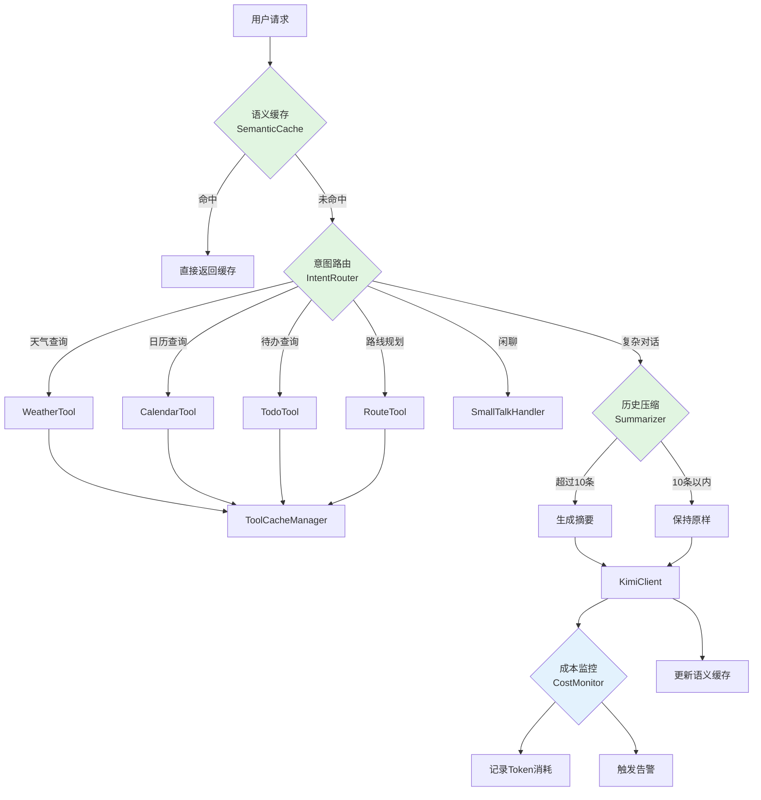
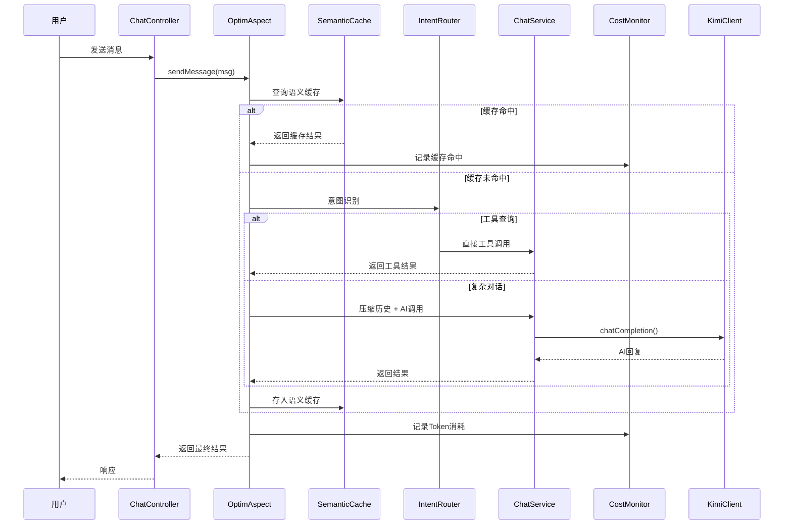
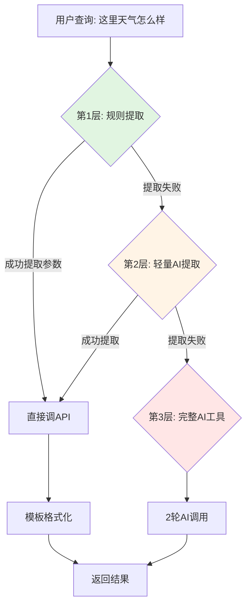

# AI调用成本优化 - 设计文档

## Overview

本设计文档定义MrsHudson AI调用成本优化系统的技术架构和实现方案。系统采用分层架构，在现有ChatService和KimiClient之间插入四层优化：语义缓存层、意图路由层、历史压缩层、工具缓存层。每层都可独立开关，支持热配置更新。

## Steering Document Alignment

### Technical Standards (tech.md)

- **Java 17 + Spring Boot 3.2**: 使用Spring AOP和Bean生命周期管理实现优化层
- **MyBatis Plus**: 缓存统计数据持久化
- **Redis**: 缓存存储后端，支持TTL和分布式部署
- **分层架构**: 保持现有Controller-Service-Mapper分层，优化层作为AOP切面插入

### Project Structure (structure.md)

新增代码遵循现有包结构：
```
com.mrshudson/
├── optim/              # 新增：优化模块
│   ├── cache/          # 缓存相关
│   ├── intent/         # 意图识别
│   ├── compress/       # 对话压缩
│   └── monitor/        # 成本监控
├── mcp/                # 现有：MCP工具
├── service/            # 现有：服务层
```

## Code Reuse Analysis

### Existing Components to Leverage

- **KimiClient**: 保留现有HTTP调用逻辑，作为最底层调用客户端
- **ChatServiceImpl**: 保留现有业务流程，优化层作为装饰器模式包装
- **ToolRegistry**: 扩展现有工具注册机制，添加缓存代理
- **RedisTemplate**: 复用现有Redis连接配置
- **ChatMessageMapper**: 复用现有消息查询，用于历史压缩
- **ConversationMapper**: 复用现有会话更新，用于标题生成优化

### Integration Points

- **ChatController**: 无感知集成，优化层对Controller透明
- **AI Service Interface**: 通过AIServiceFactory动态返回优化后的服务实现
- **Spring AOP**: 使用@Around切面拦截sendMessage方法
- **ApplicationEventPublisher**: 异步事件处理标题生成和成本统计

## Architecture

### 核心架构图



### 请求处理流程



### Modular Design Principles

- **Single File Responsibility**:
  - SemanticCacheService.java: 只处理向量相似度匹配
  - IntentRouter.java: 只处理意图分类和路由
  - ConversationSummarizer.java: 只处理消息摘要生成
  - ToolCacheManager.java: 只处理工具结果缓存
  - CostMonitorService.java: 只处理成本统计

- **Component Isolation**:
  - 每个优化组件通过接口对外提供服务
  - 组件之间通过Spring事件或接口调用交互，无直接依赖

- **Service Layer Separation**:
  - 优化层作为独立Service层，位于Controller和原始Service之间
  - 原始ChatServiceImpl保持不变

- **Utility Modularity**:
  - 相似度计算、token计数等工具类独立封装

## Components and Interfaces

### Component 1: SemanticCacheService（语义缓存服务）

**Purpose:** 基于向量相似度的智能问答缓存，通过语义匹配而非精确匹配，提高缓存命中率。

**Interfaces:**

```java
public interface SemanticCacheService {
    /**
     * 查询语义缓存
     * @param query 用户查询文本
     * @return Optional<CacheEntry> 缓存命中返回条目，否则空
     */
    Optional<CacheEntry> get(String query);

    /**
     * 存入语义缓存
     * @param query 查询文本
     * @param response AI回复
     * @param metadata 元数据（token消耗、用户ID等）
     */
    void put(String query, String response, CacheMetadata metadata);

    /**
     * 计算文本嵌入向量
     * @param text 输入文本
     * @return float[] 嵌入向量
     */
    float[] embed(String text);

    /**
     * 清理过期缓存
     * @param days 过期天数
     */
    void cleanup(int days);

    /**
     * 获取缓存统计
     */
    CacheStats getStats();
}
```

**Dependencies:**
- RedisTemplate（存储向量索引）
- RestTemplate（调用嵌入服务，可选本地模型）
- ObjectMapper（序列化）

**Reuses:**
- 使用现有Redis连接配置
- 复用现有JSON序列化配置

### Component 1.5: VectorStore（向量存储抽象层）

**Purpose:** 提供向量存储的抽象接口，支持多种后端实现（Redis简化版、Chroma、Milvus等），便于开发和生产环境切换。

**Interfaces:**

```java
public interface VectorStore {
    /**
     * 存储向量数据
     * @param id 唯一标识
     * @param query 原始查询文本
     * @param response AI回复
     * @param embedding 嵌入向量
     * @param metadata 元数据
     */
    void store(String id, String query, String response,
               float[] embedding, CacheMetadata metadata);

    /**
     * 相似度搜索
     * @param queryEmbedding 查询向量
     * @param userId 用户ID（用户隔离）
     * @param threshold 相似度阈值（0-1）
     * @return Optional<CacheEntry> 最匹配的缓存条目
     */
    Optional<CacheEntry> search(float[] queryEmbedding,
                                long userId,
                                float threshold);

    /**
     * 删除指定ID的向量
     * @param id 向量ID
     */
    void delete(String id);

    /**
     * 清理过期数据
     * @param beforeDate 在此日期之前的数据将被清理
     */
    void cleanup(LocalDateTime beforeDate);

    /**
     * 获取存储统计
     * @return VectorStoreStats 统计信息
     */
    VectorStoreStats getStats();
}

public interface EmbeddingService {
    /**
     * 将文本转换为向量
     * @param text 输入文本
     * @return float[] 嵌入向量
     */
    float[] embed(String text);

    /**
     * 批量嵌入
     * @param texts 文本列表
     * @return List<float[]> 向量列表
     */
    List<float[]> embedBatch(List<String> texts);
}
```

**实现类：**

1. **RedisVectorStore（简化版）**
   - 使用Redis Hash存储向量
   - 查询时遍历计算余弦相似度
   - 适合数据量<1万的场景
   - 零额外部署成本

2. **ChromaVectorStore（推荐生产小规模）**
   - 使用Chroma向量数据库
   - 支持HNSW索引，高效相似度搜索
   - 单容器部署，轻量级
   - 适合数据量<100万场景

3. **MilvusVectorStore（生产大规模）**
   - 使用Milvus分布式向量数据库
   - 十亿级向量支持
   - 多种索引类型（IVF、HNSW）
   - 适合企业级部署

**Dependencies:**
- RedisTemplate（Redis实现）
- ChromaClient（Chroma实现）
- MilvusClient（Milvus实现）
- EmbeddingService（文本向量化）

**配置示例：**

```yaml
# application.yml
vector:
  store:
    type: redis  # 选项: redis, chroma, milvus, none
  embedding:
    type: keyword  # 选项: keyword(简化), api(外部API)
    dimensions: 100  # 向量维度
```

### Component 2: IntentRouter（意图路由）

**Purpose:** 快速识别用户意图，将工具类查询直接路由到对应工具，跳过AI调用。

**Interfaces:**

```java
public interface IntentRouter {
    /**
     * 路由请求到对应处理器
     * @param message 用户消息
     * @param userId 用户ID
     * @return RouteResult 路由结果（包含响应或需要AI处理标记）
     */
    RouteResult route(String message, Long userId);

    /**
     * 识别意图类型
     * @param message 用户消息
     * @return IntentType 意图类型
     */
    IntentType classify(String message);

    /**
     * 注册新的意图处理器
     * @param intentType 意图类型
     * @param handler 处理器
     */
    void registerHandler(IntentType intentType, IntentHandler handler);
}

public enum IntentType {
    WEATHER_QUERY,      // 天气查询
    CALENDAR_QUERY,     // 日历查询
    TODO_QUERY,         // 待办查询
    ROUTE_QUERY,        // 路线规划
    CALENDAR_CREATE,    // 创建日历事件
    TODO_CREATE,        // 创建待办
    SMALL_TALK,         // 闲聊问候
    GENERAL_CHAT,       // 通用对话（需AI处理）
    UNKNOWN             // 未知，需进一步判断
}

public interface IntentHandler {
    /**
     * 处理意图请求
     * @param message 用户消息
     * @param userId 用户ID
     * @return HandlerResult 处理结果
     */
    HandlerResult handle(String message, Long userId);

    /**
     * 获取置信度阈值
     */
    double getConfidenceThreshold();
}
```

**Dependencies:**
- ToolRegistry（调用具体工具）
- WeatherService（天气查询）
- CalendarService（日历操作）
- TodoService（待办操作）
- RouteService（路线规划）

**Reuses:**
- 复用现有ToolRegistry机制
- 复用现有Service层实现

**三层混合模式架构（增强版意图路由）：**



**第1层：规则提取（零AI，90%覆盖率）**

```java
public class RuleBasedExtractor implements ParameterExtractor {

    public ExtractionResult extract(String message, IntentType intent) {
        switch (intent) {
            case WEATHER_QUERY:
                return extractWeatherParams(message);
            case CALENDAR_QUERY:
                return extractCalendarParams(message);
            case TODO_QUERY:
                return extractTodoParams(message);
            case ROUTE_QUERY:
                return extractRouteParams(message);
            default:
                return ExtractionResult.failed();
        }
    }

    private ExtractionResult extractWeatherParams(String message) {
        // 城市提取规则
        String city = extractByPatterns(message, CITY_PATTERNS);
        if (city == null) {
            city = extractByRegex(message, "(\\S+)(?:市|县|区)?的?天气");
        }

        // 日期提取规则
        String date = extractByPatterns(message, DATE_PATTERNS);

        // 规则失败标记，进入下一层
        if (city == null || isAmbiguous(city)) {
            return ExtractionResult.failed()
                .withReason("无法确定城市: " + (city != null ? city : "null"));
        }

        return ExtractionResult.success()
            .withParam("city", city)
            .withParam("date", date != null ? date : "today");
    }
}
```

**提取规则库示例：**

| 参数类型 | 规则模式 | 示例 |
|---------|---------|------|
| 城市（直接） | 预定义城市名 | "北京天气" → 北京 |
| 城市（正则） | `(\S+)天气` | "查一下深圳天气" → 深圳 |
| 城市（模糊） | `这里/当地/所在城市` | ❌ 失败，进入轻量AI |
| 日期（直接） | 今天/明天/后天 | "明天天气" → 明天 |
| 日期（相对） | 后天/大后天/下周 | "下周三天气" → 2024-03-10 |
| 路线起点/终点 | `从(\S+)(?:到|去)(\S+)` | "从北京到上海" → 起点:北京,终点:上海 |
| 路线方式 | 步行/驾车/公交 | "怎么去..." → 默认驾车 |

**第2层：轻量AI提取（低成本，5%覆盖率）**

当规则提取失败时，调用轻量级AI仅做参数提取（不生成完整回复）：

```java
@Service
public class LightweightAiExtractor implements ParameterExtractor {

    @Autowired
    private KimiClient kimiClient;

    public ExtractionResult extract(String message, IntentType intent) {
        // 极简提示词，只要求提取参数
        String prompt = buildExtractionPrompt(message, intent);

        // 使用轻量模型或限制token
        ChatRequest request = ChatRequest.builder()
            .model("moonshot-v1-8k")  // 或更轻量模型
            .messages(List.of(
                Message.system("你是一个参数提取器，只返回JSON格式参数，不解释。"),
                Message.user(prompt)
            ))
            .maxTokens(100)  // 严格限制输出长度
            .temperature(0.1)  // 低随机性
            .build();

        ChatResponse response = kimiClient.chatCompletion(request);
        return parseExtractionResult(response.getContent());
    }

    private String buildExtractionPrompt(String message, IntentType intent) {
        return switch (intent) {
            case WEATHER_QUERY -> String.format("""
                从以下查询中提取城市和日期，返回JSON格式：
                查询: "%s"
                城市列表: [北京, 上海, 广州, 深圳, 杭州, ...]
                日期格式: yyyy-MM-dd 或 "今天"/"明天"
                如果无法确定城市，返回 {"city": null}
                只返回JSON，不解释。
                """, message);
            case CALENDAR_QUERY -> String.format("""
                提取日期范围，返回JSON：
                查询: "%s"
                返回格式: {"startDate": "yyyy-MM-dd", "endDate": "yyyy-MM-dd"}
                """, message);
            default -> message;
        };
    }
}
```

**轻量AI vs 完整AI对比：**

| 维度 | 轻量AI提取 | 完整AI工具调用 |
|-----|-----------|--------------|
| **提示词长度** | 50-100字 | 500+字（系统提示+工具描述） |
| **maxTokens** | 100 | 800+ |
| **调用轮数** | 1轮 | 2轮 |
| **预估token** | 200-300 | 1500-2000 |
| **成本比例** | 1x | 6-10x |
| **响应时间** | 500ms-1s | 2-4s |

**第3层：完整AI工具调用（保底，<5%覆盖率）**

当轻量AI也失败时（如表达过于复杂），回退到标准AI工具调用：

```java
public class FullAiToolHandler implements IntentHandler {

    public HandlerResult handle(String message, Long userId) {
        // 标准MCP工具调用流程
        // 第1轮：AI判断工具
        // 执行工具
        // 第2轮：AI生成回复
        return aiService.chatWithTools(message, userId);
    }
}
```

**三层决策流程：**

```java
@Service
public class HybridIntentRouter implements IntentRouter {

    @Autowired
    private RuleBasedExtractor ruleExtractor;

    @Autowired
    private LightweightAiExtractor lightAiExtractor;

    @Autowired
    private FullAiToolHandler fullAiHandler;

    @Autowired
    private OptimProperties optimProperties;

    public RouteResult route(String message, Long userId) {
        // 1. 识别意图
        IntentType intent = classify(message);

        // 2. 第1层：规则提取
        ExtractionResult ruleResult = ruleExtractor.extract(message, intent);
        if (ruleResult.isSuccess()) {
            costMonitor.recordLayerUsage("rule");
            return executeTool(intent, ruleResult.getParams());
        }

        // 3. 第2层：轻量AI提取（如果启用）
        if (optimProperties.isLightweightAiEnabled()) {
            ExtractionResult aiResult = lightAiExtractor.extract(message, intent);
            if (aiResult.isSuccess()) {
                costMonitor.recordLayerUsage("lightweight_ai");
                return executeTool(intent, aiResult.getParams());
            }
        }

        // 4. 第3层：完整AI工具调用（保底）
        costMonitor.recordLayerUsage("full_ai");
        return fullAiHandler.handle(message, userId);
    }
}
```

**降级策略配置：**

```yaml
optim:
  intent:
    router:
      mode: hybrid  # rule-only / hybrid / ai-only
      layers:
        rule:
          enabled: true
          priority: 1
        lightweight-ai:
          enabled: true
          priority: 2
          model: moonshot-v1-8k  # 可配置轻量模型
          max-tokens: 100
          timeout: 2000ms
        full-ai:
          enabled: true
          priority: 3
          use-mcp-tools: true
```

**预期分流效果：**

| 用户表达 | 处理层级 | AI调用 | 占比估计 |
|---------|---------|--------|---------|
| "北京天气" | 规则层 | 0轮 | 70% |
| "查一下深圳明天天气" | 规则层 | 0轮 | 15% |
| "这里天气怎么样" | 轻量AI | 1轮（提取） | 10% |
| "离深圳最近的海边城市天气" | 完整AI | 2轮 | 5% |

**成本对比（单次查询）：**

| 方案 | 平均AI调用 | 平均Token | 成本 | 覆盖率 |
|-----|-----------|----------|------|-------|
| 纯规则 | 0轮 | 0 | ¥0 | 85%零AI |
| **三层混合（推荐）** | **0.2轮** | **~100** | **¥0.02** | **95%+** |
| 纯AI工具 | 2轮 | ~1500 | ¥0.30 | 100% |

### Component 3: ConversationSummarizer（对话压缩器）

**Purpose:** 当对话历史过长时，将早期消息压缩为摘要，减少token消耗。

**Interfaces:**

```java
public interface ConversationSummarizer {
    /**
     * 压缩消息列表
     * @param messages 原始消息列表
     * @return List<Message> 压缩后的消息列表
     */
    List<Message> compress(List<Message> messages);

    /**
     * 判断是否需要压缩
     * @param messages 消息列表
     * @return boolean 是否需要压缩
     */
    boolean needsCompression(List<Message> messages);

    /**
     * 生成对话摘要
     * @param messages 需要摘要的消息
     * @return String 摘要文本
     */
    String generateSummary(List<Message> messages);

    /**
     * 估算消息列表的token数
     * @param messages 消息列表
     * @return int token数量估算
     */
    int estimateTokens(List<Message> messages);
}

public class CompressionConfig {
    private int triggerThreshold = 10;        // 触发压缩的消息数
    private int keepRecentMessages = 4;       // 保留的最近消息数
    private int summaryMaxLength = 100;       // 摘要最大字数
    private double compressionRatio = 0.5;    // 压缩率阈值
}
```

**Dependencies:**
- KimiClient（调用轻量级模型生成摘要）
- ChatMessageMapper（查询历史消息）

**Reuses:**
- 复用现有Message DTO
- 复用KimiClient基础调用能力

### Component 4: ToolCacheManager（工具缓存管理）

**Purpose:** 缓存工具调用结果，避免短时间内重复调用外部API或数据库。

**Interfaces:**

```java
public interface ToolCacheManager {
    /**
     * 获取缓存的工具结果
     * @param toolName 工具名称
     * @param params 工具参数
     * @return Optional<String> 缓存结果
     */
    Optional<String> get(String toolName, String params);

    /**
     * 存入工具结果缓存
     * @param toolName 工具名称
     * @param params 工具参数
     * @param result 工具结果
     * @param ttl 过期时间（秒）
     */
    void put(String toolName, String params, String result, long ttl);

    /**
     * 清除指定工具的缓存
     * @param toolName 工具名称
     */
    void invalidate(String toolName);

    /**
     * 清除指定参数的缓存
     * @param toolName 工具名称
     * @param params 工具参数
     */
    void invalidate(String toolName, String params);

    /**
     * 数据变更时清除相关缓存
     * @param entityType 实体类型（calendar/todo）
     * @param userId 用户ID
     */
    void invalidateOnChange(String entityType, Long userId);
}

public class ToolCacheConfig {
    private long weatherTtl = 600;      // 天气缓存10分钟
    private long calendarTtl = 120;     // 日历缓存2分钟
    private long todoTtl = 120;         // 待办缓存2分钟
    private long routeTtl = 300;        // 路线规划缓存5分钟
}
```

**Dependencies:**
- RedisTemplate（缓存存储）
- ApplicationEventPublisher（监听数据变更事件）

**Reuses:**
- 复用现有Redis配置
- 复用Spring事件机制

### Component 5: CostMonitorService（成本监控服务）

**Purpose:** 记录和分析AI调用成本，提供统计报表和异常告警。

**Interfaces:**

```java
public interface CostMonitorService {
    /**
     * 记录AI调用
     * @param userId 用户ID
     * @param conversationId 会话ID
     * @param inputTokens 输入token数
     * @param outputTokens 输出token数
     * @param cost 成本（元）
     * @param hitCache 是否命中缓存
     */
    void recordAiCall(Long userId, Long conversationId,
                      int inputTokens, int outputTokens,
                      BigDecimal cost, boolean hitCache);

    /**
     * 记录缓存命中
     * @param userId 用户ID
     * @param cacheType 缓存类型（semantic/tool）
     */
    void recordCacheHit(Long userId, String cacheType);

    /**
     * 记录意图路由分层使用情况
     * @param userId 用户ID
     * @param layer 使用层级（rule/lightweight_ai/full_ai）
     */
    void recordLayerUsage(Long userId, String layer);

    /**
     * 获取成本统计
     * @param startDate 开始日期
     * @param endDate 结束日期
     * @return CostStatistics 统计数据
     */
    CostStatistics getStatistics(LocalDate startDate, LocalDate endDate);

    /**
     * 获取用户成本明细
     * @param userId 用户ID
     * @param date 日期
     * @return UserCostDetail 用户成本明细
     */
    UserCostDetail getUserCostDetail(Long userId, LocalDate date);

    /**
     * 检查是否需要告警
     */
    void checkAndAlert();
}

public class CostAlertConfig {
    private BigDecimal dailyCostThreshold = new BigDecimal("50");  // 日成本阈值（元）
    private int dailyCallThreshold = 100;                           // 日调用次数阈值
    private List<String> alertChannels = Arrays.asList("log", "email");
}
```

**Dependencies:**
- CostRecordMapper（成本记录持久化）
- JavaMailSender（邮件告警，可选）
- ScheduledExecutorService（定时统计）

## Data Models

### CacheEntry（缓存条目）

```java
@Data
@Builder
public class CacheEntry {
    private String id;                    // 缓存ID（UUID）
    private String query;                 // 原始查询文本
    private String response;              // AI回复
    private float[] embedding;            // 查询向量
    private Long userId;                  // 用户ID
    private LocalDateTime createdAt;      // 创建时间
    private LocalDateTime lastAccessed;   // 最后访问时间
    private int accessCount;              // 访问次数
    private int inputTokens;              // 原始输入token数
    private int outputTokens;             // 原始输出token数
}
```

### CostRecord（成本记录）

```java
@Data
@TableName("ai_cost_record")
public class CostRecord {
    @TableId(type = IdType.AUTO)
    private Long id;

    @TableField("user_id")
    private Long userId;

    @TableField("conversation_id")
    private Long conversationId;

    @TableField("input_tokens")
    private Integer inputTokens;

    @TableField("output_tokens")
    private Integer outputTokens;

    @TableField("cost")
    private BigDecimal cost;

    @TableField("cache_hit")
    private Boolean cacheHit;

    @TableField("model")
    private String model;

    @TableField(value = "created_at", fill = FieldFill.INSERT)
    private LocalDateTime createdAt;
}
```

### RouteResult（路由结果）

```java
@Data
@Builder
public class RouteResult {
    private boolean handled;          // 是否已处理
    private String response;          // 响应内容
    private IntentType intentType;    // 识别的意图类型
    private double confidence;        // 置信度
    private boolean needAiProcess;    // 是否需要AI处理
    private String reason;            // 路由原因说明
}
```

## Error Handling

### Error Scenarios

1. **Redis连接失败**
   - **Handling:** 捕获RedisConnectionFailureException，降级为无缓存模式
   - **User Impact:** 用户无感知，只是AI调用次数增加，记录ERROR日志

2. **向量服务不可用**
   - **Handling:** 语义缓存查询失败时，直接视为缓存未命中
   - **User Impact:** 无感知，走正常AI调用流程

3. **意图识别误判**
   - **Handling:** 设置置信度阈值（0.7），低于阈值时降级到AI处理
   - **User Impact:** 无感知，只是响应稍慢

4. **对话压缩失败**
   - **Handling:** 摘要生成失败时，保留原始消息列表
   - **User Impact:** 无感知，只是token消耗未优化

5. **成本统计数据库写入失败**
   - **Handling:** 异步写入，失败时记录到本地日志文件
   - **User Impact:** 无感知，管理员可能看不到部分统计数据

## Testing Strategy

### Unit Testing

- **SemanticCacheServiceTest**: 测试向量相似度计算、缓存命中/未命中逻辑
- **IntentRouterTest**: 测试各种意图的识别准确率
- **ConversationSummarizerTest**: 测试压缩触发条件、摘要生成
- **ToolCacheManagerTest**: 测试缓存过期、数据变更清除
- **CostMonitorServiceTest**: 测试成本计算、告警触发

### Integration Testing

- **OptimLayerIntegrationTest**: 测试完整优化流程，从请求接入到响应返回
- **CacheConsistencyTest**: 测试缓存与数据库的一致性
- **FallbackIntegrationTest**: 测试降级场景下的系统行为

### End-to-End Testing

- **CostReductionE2ETest**: 模拟真实用户场景，验证整体成本降低效果
- **CacheHitRateE2ETest**: 验证缓存命中率是否达到预期（目标>40%）
- **ConcurrentAccessE2ETest**: 验证并发场景下的缓存一致性

### 性能测试

- **LatencyBenchmark**: 测量各优化层的延迟开销
- **ThroughputBenchmark**: 测量系统整体吞吐量变化
- **MemoryUsageBenchmark**: 测量缓存对内存的影响
